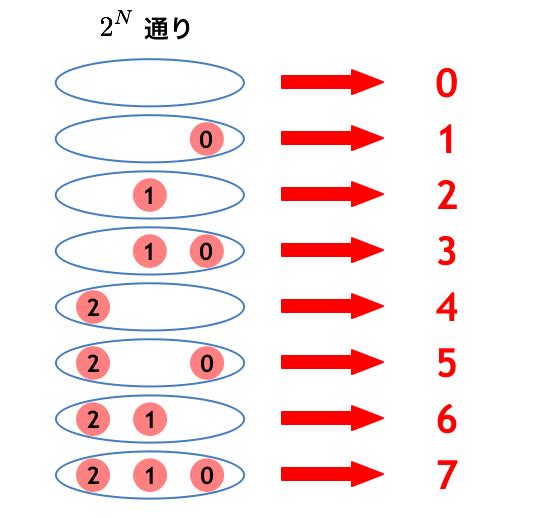

<!--
_class: title
_paginate: false
-->

# １. 全探索を書こう！

2022/12/13 mono

---

<!-- class: slides  -->

## 標準入力

```python
# 標準入力を 1 行受け取り、 S という変数に代入する
S = input()
# 標準入力を 1 行受け取り、 S, T という変数に代入する
# split() の括弧の中身(引数)に何も指定しないと空白区切りになります
T, U = input().split()
# 標準入力を 1 行受け取り、空白で区切り、一括で整数型に変換し、 A, B という変数に代入する
A, B = map(int, input().split())
# 入力を整数型配列として受け取る
C = list(map(int, input().split()))
```

---

## 問題を解いてみよう(入出力の練習)

PracticeA - Welcome to AtCoder
https://atcoder.jp/contests/abs/tasks/practice_1

---

## 全探索とは

### あり得るパターンを全部列挙する

### 例：素数判定

- #### 2 以上 N−1 以下の数で N を順番に割る
- #### N を割り切れる数が存在しない場合、 N は素数
- #### 1 は例外
  https://algo-method.com/tasks/222/editorial

---

## ペアの全探索

- 2 つのペアの選び方をすべて考える
- 重複のないように探索する

https://algo-method.com/descriptions/113

---

## bit 全探索とは

### n 個の要素からなる集合の部分集合（組み合わせ）を全て調べ上げる

### 例題

> 3 つの数字{1,2,8}の中から何個でも良いので自由に数字を選んで 10 を作れるか？

---

```python
n=3
k=10
a=[1,2,8]
for bit in range(2**n):
    sum2 = 0
    for i in range(n):
        # bitにフラグが立っているかどうかを判定
        if bit & (1 << i):
            # フラグが立っていればsumに加算
            sum2 += a[n-1-i]

    if sum2 == k:
        print("Yes")
        exit()#プログラムを終了
print("No")
```

---

## 組み合わせを 2 進数で表現



---

## 練習問題

- 素数を数える
  - https://algo-method.com/tasks/234
- 組み合わせ
  - https://algo-method.com/tasks/259
- bit 全探索
  - https://algo-method.com/tasks/1085
  - https://algo-method.com/tasks/1087
