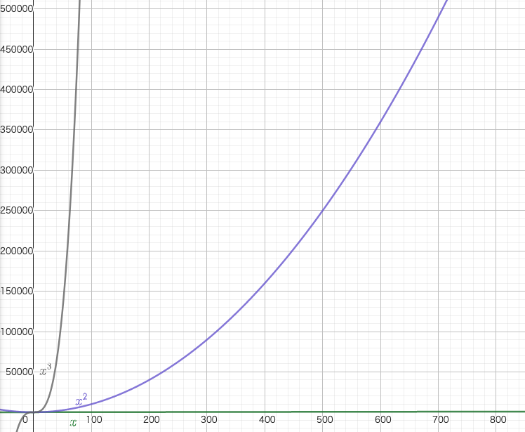
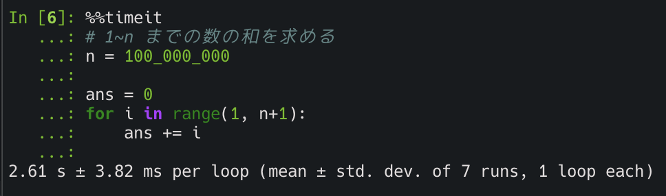
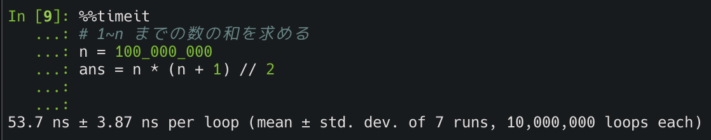

<!--
headingDivider: 1
_class: title
_paginate: false
-->
# 計算量を学ぼう！

<a style="color:white; text-decoration: none;" href="https://github.com/kentakom1213">ぱうえる（けんた）</a>

# 速いコードが書きたい！

でも**速いコード**ってどうやって評価する？？

- 「$1,000,000$個のデータに対して$5$秒で終了しました！」
  - データの個数が変わったらどうなる？？
  - そもそもPythonで実行するかC言語で実行するかでも変わりそう

<hr>

**「データの大きさ」や「実行する環境」に依存しない評価方法が必要**
<div style="color:red; font-size:50px">→計算量の出番</div>

# オーダー記法 (1/2)

<div style="float:left;">

  
</div>

- $n,n^2,n^3$では$n$が大きくなったとき
  値が大きく変化する
- 定数倍を考えないで、$n$ の項だけに
  注目すればいいのでは？？

→ $O$ (ランダウの記号)を用いる

# オーダー記法 (2/2)

- 計算量は基本的にオーダー記法で書く
  1. 一番大きい項のみ残して表記する
    $n! > a^n > n^a > \log n > a$　（$a$ は定数）
  2. 定数倍は無視する

オーダー記法の例）
$$
\begin{align*}
  5n^3+4n^2+100n &\longrightarrow O(n^3)\\
  2^n+n^{100}+10^9n &\longrightarrow O(2^n)\\
\end{align*}
$$

# コードの計算量の調べ方

- $n$ 回のループをする → $O(n)$
- $n$ 回のループの中で $n$ 回のループをする（二重ループ）
  → $O(n^2)$
- [bit全探索](https://drken1215.hatenablog.com/entry/2019/12/14/171657)（$n$ 個の要素について**ある**/**ない**の$2$通りを考える）
  → $O(2^n)$
- $n$ 個の順列を全て調べる → $O(n!)$


# ここまでの復習
このコードの計算量は？？

```python
# 1~n までの数の和を求める
n = int(input())

ans = 0
for i in range(1, n+1):
    ans += i

print(ans)
```

# ここまでの復習（答え）
このコードの計算量は？？

```python
# 1~n までの数の和を求める
n = int(input())

ans = 0
for i in range(1, n+1):
    ans += i

print(ans)
```

→ $O(n)$ （$n$ までのループを1回している）


# 計算量の使い方
- 一般的なコンピュータが1秒間に計算できる回数は**約 $\mathbf{10^8}$ 回**
- $n$ の大きさと実際の値は次の表のようになります

<hr>

#### 参考
- 計算量オーダーの求め方を総整理！〜どこからlogが出て来るか〜
  https://qiita.com/drken/items/872ebc3a2b5caaa4a0d0#1-3-%E8%A8%88%E7%AE%97%E9%87%8F%E3%81%AE%E4%BD%BF%E3%81%84%E6%96%B9


#
$$
\scriptsize
\begin{array}{lllllll}
  \log n & n & n\log n & n^2 & n^3 & 2^n & n!\\
  \hline
  2 & \mathbf{5} & 12 & 25 & 130 & 30 & 120\\
  3 & \mathbf{10} & 33 & 100 & 1000 & 1024 & 3628800\\
  4 & \mathbf{15} & 59 & 225 & 3375 & 32768 & -\\
  4 & 20 & 86 & 400 & 8000 & 1048576 & -\\
  5 & 25 & 116 & 625 & 15625 & - & -\\
  5 & 30 & 147 & 900 & 27000 & - & -\\
  7 & 100 & 664 & 10000 & 1000000 & - & -\\
  8 & 300 & 2468 & 90000 & 27000000 & - & -\\
  10 & 1000 & 9966 & 1000000 & - & - & -\\
  13 & 10000 & 132877 & 100000000 & - & - & -\\
  16 & 100000 & 1660964 & - & - & - & -\\
  \hline
\end{array}
$$


# 計算量を落とすテクニック

今回は代表的なものを3つ紹介します。

- **公式を使う**
  比較的単純な手法
- **累積和**
  数列の区間の和を高速に求めるアルゴリズム
- **二分探索**
  条件を満たす値があるかを高速に調べるアルゴリズム


# 公式を使う (1/3)

上のコードは、$1\!\sim\!n$ の和を求めるために $O(n)$ の計算をしています
（$n = 100,000,000$ で2.6秒くらい必要）




# 公式を使う (2/3)

この公式を使えば、、

$$
\sum_{i=1}^{n} = \frac{1}{2} n(n+1)
$$

```python
# 1~n までの数の和を求める
n = int(input())
ans = n * (n + 1) // 2

print(ans)
```


# 公式を使う (3/3)



なんと、53.7**ナノ**秒で終了！！

→ 約**5億倍**の高速化（ちょっと極端な例ではあるけど）


# 累積和 (/n)

あるたい焼き屋さんでは 毎日、売れた個数を記録しています。
営業開始から $7$ 日目までの売り上げは以下の通りでした。

$$
\scriptsize
\begin{array}{|c|c|c|c|c|c|}
  \hline
  1日\!目 & \colorbox{violet}{2日\!目} & \colorbox{violet}{3日\!目} & \colorbox{violet}{4日\!目} & \colorbox{violet}{5日\!目} & 6日\!目 & 7日\!目\\
  \hline
  20 & 50 & 30 & 10 & 30 & 0 & 40\\
  \hline
\end{array}
$$

$2$ 日目から $5$ 日目までの売り上げの合計はいくらでしょうか？

→ $50+30+10+30=120$（個）

# 累積和 (/n)

一般化してみると？？
<hr>

あるたい焼き屋さんでは、毎日売り上げを記録しています。
営業開始から $i$ 日目の売り上げは $A_i$ 円でした。
このとき、以下の問題に答えて下さい。
$i$ 日目から $j$ 日目までの売り上げの合計はいくらでしょうか？
<hr>


# 累積和 (/n)

$$
\begin{array}{|c|c|c|c|c|c|}
  \hline
  A_1 & A_2 & A_3 & A_4 & A_5 & A_6 & A_7\\
  \hline
  20 & 50 & 30 & 10 & 30 & 0 & 40\\
  \hline
\end{array}
$$


# 参考
- 計算量オーダーの求め方を総整理！ 〜どこからlogが出て来るか〜
  https://qiita.com/drken/items/872ebc3a2b5caaa4a0d0
