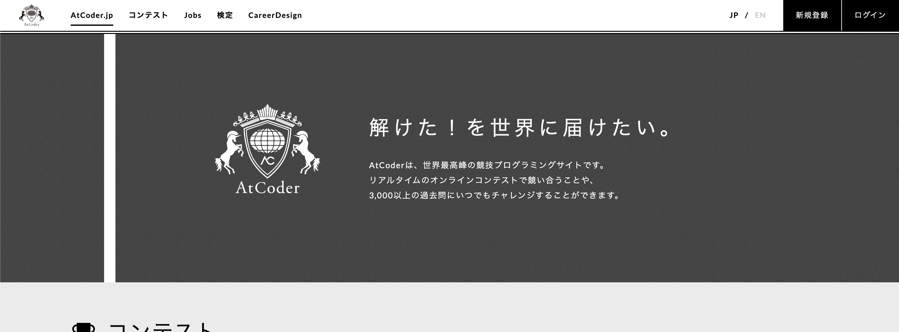
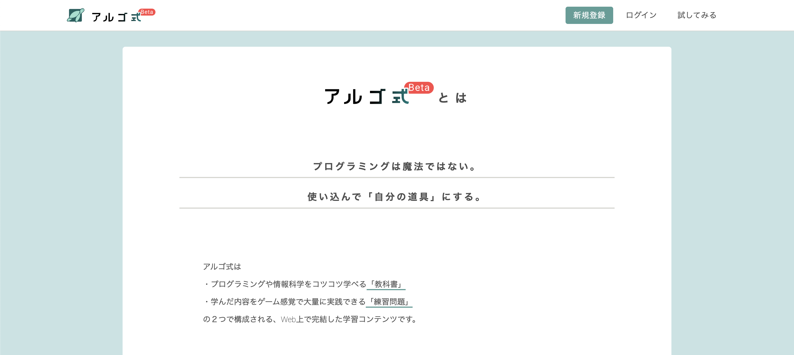

--- 
marp: true
math: katex
header: "第4回 出力層の設計"
footer: "2022/11/17 ゼロイチゼミ <a href=\"https://twitter.com/nu_zero_one\" style=\"color:white\">@nu_zero_one</a>"
theme: 01semi
paginate: true
---

<!--
headingDivider: 1
_class: title
_paginate: false
-->
# アルゴリズムゼミ
高速で安全なプログラムを作るために

# 担当
- けんた（情報/自然情報）
- ひらく（情報/自然情報）
- mono（情報/自然情報）

# 日程
- 第1回：2022/12/13　5限（16:30~18:00）
- 第2回：2022/12/19　5限（16:30~18:00）
- 第3回：2022/12/26　5限（16:30~18:00）

# 進め方
## 教材
- [アルゴ式](https://algo-method.com/)：アルゴリズムの学習に使用
- [AtCoder](https://atcoder.jp/)：演習に使用

# 内容 (1/2)
- 第1回：[全探索を書こう！](https://algo-method.com/courses/3)
    - 二重ループ
    - bit全探索
- 第2回：[計算量とは何か](https://algo-method.com/courses/16)
    - 遅いコードと速いコードの違い
    - 実例1：線形探索と二分探索
    - 実例2：遅いソートと速いソート

# 内容 (2/2)
-  第3回：コンテストに参加してみよう！
    - 「バーチャルコンテスト」という機能でコンテストに挑戦！
    - これまでの内容を使って問題を解いてみよう！

# 講義
- 第0回：進め方（担当：けんた）
  - 第1回の冒頭15分くらいで実施
  - アルゴリズムゼミの進め方
  - アルゴ式、AtCoderのアカウント登録
- 第1回：全探索（担当：mono）
- 第2回：計算量（担当：けんた）
- 題3回：コンテスト（担当：ひらく）

# AtCoderに登録しよう！

アカウントを持っていない人
- [atcoder.jp](https://atcoder.jp/)にアクセス
- 右上の**新規登録**から登録してください

# アルゴ式に登録しよう！

アカウントを持っていない人
- [algo-method.com](https://algo-method.com/)にアクセス
- 右上の**新規登録**から登録してください

